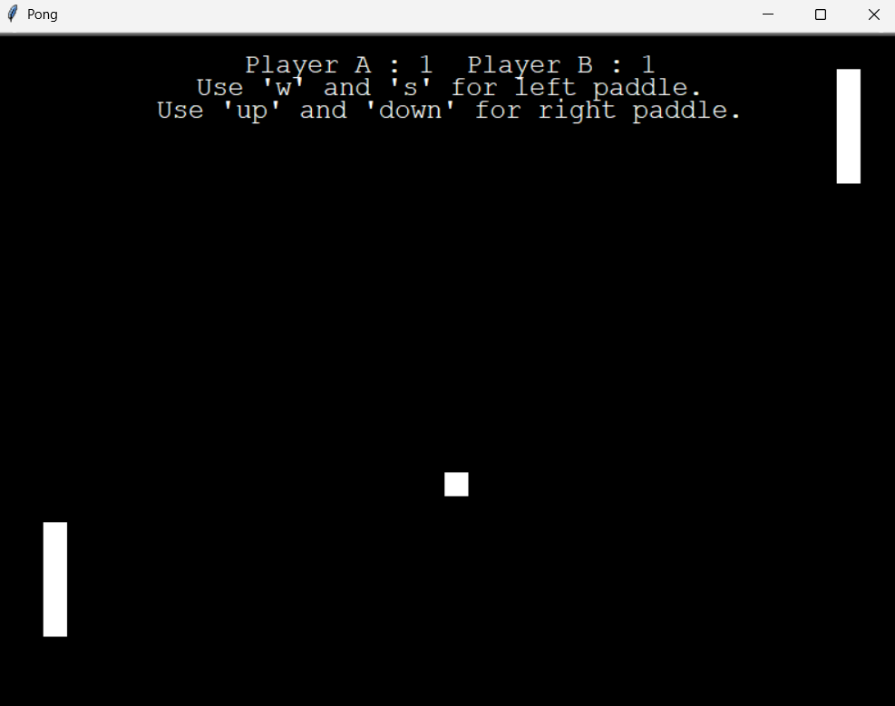

# 🏓 Pong Game

A simple classic Pong game built using Python's `turtle` graphics module.

---

## 🎮 Controls

- **Left Paddle (Player A)**:

  - Move Up: `W`
  - Move Down: `S`

- **Right Paddle (Player B)**:

  - Move Up: `↑` (Up Arrow)
  - Move Down: `↓` (Down Arrow)

---

## 🗂 Setup Instructions

1. Download or clone the repository and ensure all files are in the same folder:

   - `Pong.py`
   - `bounce.wav`

2. Run the game:

   ```bash
   python Pong.py
   ```

---

## 🛠 Requirements

- Python 3.x
- Windows (due to the use of `winsound` module)

---

## 📸 Preview



---
